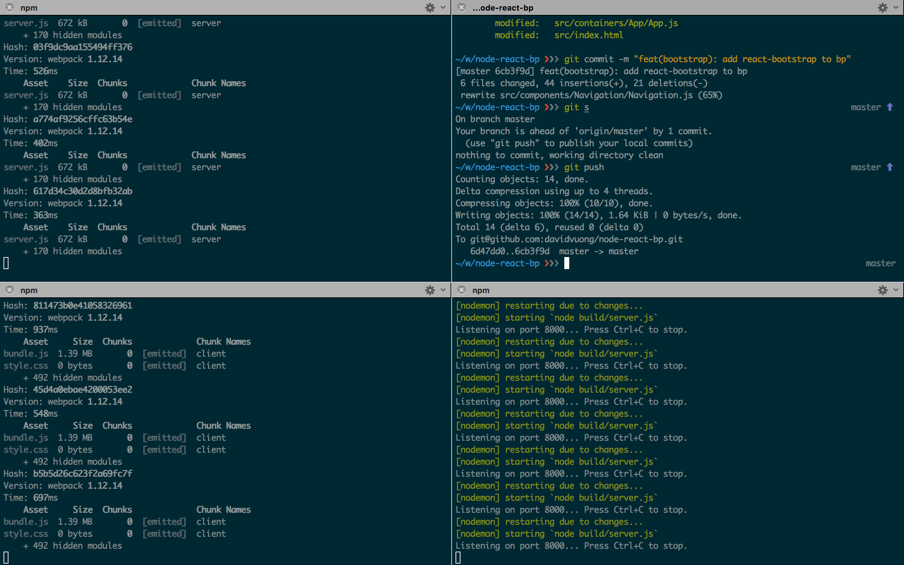

# NodeJS + ReactJS Boilerplate

**Welcome to node-react-bp!**

This is an incredibly simple boilerplate repository for NodeJS and ReactJS projects. It uses [SCSS](http://sass-lang.com/) as the CSS pre-processor, [webpack](https://webpack.github.io/) as the module bundler, [Babel](https://babeljs.io/) as the ES6 transpiler, and [Express](http://expressjs.com/) as the web application framework. Take a look at the [package.json](package.json) file for more details.

## Getting Started

1. Clone the git repository:

  ```
  git clone git@github.com:davidvuong/node-react-bp.git
  ```

1. Download the latest version of NodeJS (as of now, v5.7.1):

  ```
  nvm install v5.7.1
  nvm use v5.7.1
  ```

1. Install all the project dependencies:

  ```
  cd node-react-bp/
  npm install
  ```

## Executing `node-react-bp`



There are 3 commands you need to run in order for everything to run correctly. I like splitting my terminal screen, each screen split handling a separate command.

1. The first command compiles your client side SCSS, JSX, and ES6 files into a bundle (bundle.js, style.css).

  ```
  npm run watch:client
  ```

1. The second command compiles all your server side ES6 and JSX files into a server.js bundle.

  ```
  npm run watch:server
  ```

1. Finally, the last command starts the ExpressJS server.

  ```
  npm start
  ```

Whenever a change is made to any SCSS, ES6 or JSX files, your code will be re-compiled and if necessary, the ExpressJS server will also restart. I also have ESLint setup to raise any warnings/errors if your code doesn't comply to the rules defined in `.eslintrc`.

## Resources

There are some really great resources online. There's a dump of most (if not all) of the resources I found useful when creating this boilerplate project:

* https://github.com/airbnb/javascript/tree/master/react
* https://egghead.io/lessons/javascript-redux-the-single-immutable-state-tree
* https://github.com/erikras/react-redux-universal-hot-example
* https://facebook.github.io/react/index.html
* https://medium.com/lexical-labs-engineering/redux-best-practices-64d59775802e
* http://www.sitepoint.com/video-controlled-vs-uncontrolled-components-in-react/
* https://scotch.io/tutorials/build-a-restful-api-using-node-and-express-4
* https://github.com/unicorn-standard/starter-kit/
* http://jamesknelson.com/writing-happy-stylesheets-with-webpack/
* https://www.bensmithett.com/smarter-css-builds-with-webpack/
* http://webpack.github.io/docs/using-loaders.html
* https://www.twilio.com/blog/2015/08/setting-up-react-for-es6-with-webpack-and-babel-2.html
* http://survivejs.com/webpack/getting-started/
* http://redux.js.org/docs/basics/UsageWithReact.html
* https://medium.com/@dan_abramov/smart-and-dumb-components-7ca2f9a7c7d0#.cz4lfz6h0
